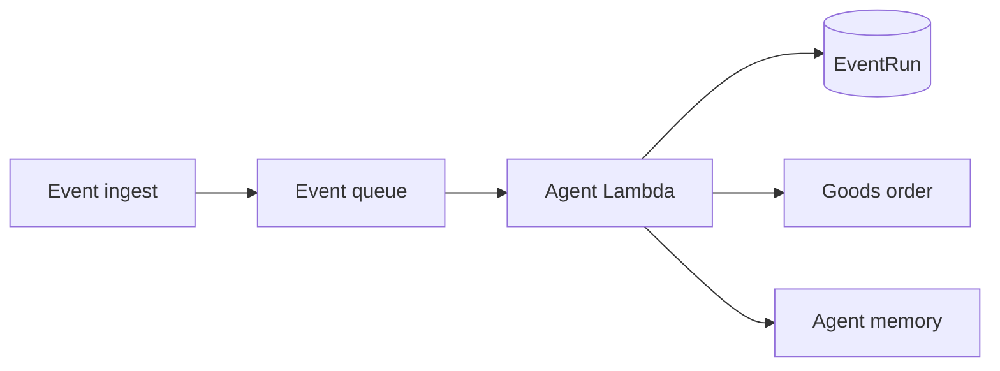

The **agent runtime** is the Lambda that turns events into reward executions. It is the only consumer of the event queue and the source of truth for reward processing semantics.

## Pipeline

<Steps>
  <Step title="Claim the event">
    The Lambda dequeues a message and reads its `discriminant` and `event_id`. Both are required — messages missing either are acknowledged and dropped.
  </Step>
  <Step title="Resolve the reward">
    The discriminant maps directly to an active `Agent` row created by `/agent`. No LLM classification, no Slack-team fallback. If no active reward matches, the message is acknowledged and dropped.
  </Step>
  <Step title="Enforce idempotency">
    Archer looks up `(event_id, agent_id)`. If an `EventRun` already exists, the run is a no-op.
  </Step>
  <Step title="Run the reward">
    The agent loads the reward's `logic`, the payload, and any prior agent memory for the account, then executes one of: record-only (DB stub), create a goods order, save memory, or no-op.
  </Step>
  <Step title="Persist the run">
    Archer writes an `EventRun` row containing the event id, agent id, decision, and any side-effect references (goods order id, memory key).
  </Step>
</Steps>

## Agent tools

The runtime has a fixed set of tools:

- **CSV / JSON event data loading** — read structured payload data.
- **Recipient and event-run lookup** — resolve who to reward and avoid re-running historical events.
- **Reward rule run recording** — persist `EventRun` rows.
- **Identifier resolution** — match user emails, Slack IDs, or external IDs to Archer recipients.
- **Goods form email and direct goods-order creation** — fulfill `office` and `customer` rewards.
- **Agent memory save / query / list** — durable per-account memory keyed by the agent.

## Idempotency contract

`EventRun` is unique on `(event_id, agent_id)`. Three rules follow:

1. **Same event, same reward, same outcome.** Retries are safe.
2. **Same event, different reward** — runs once per reward. Useful when two rewards share an upstream signal.
3. **No `event_id` provided** — Archer cannot dedupe. Every retry runs the reward again.

## Execution status today

Reward execution is currently a **DB-only stub**: the runtime writes an `EventRun` and (for `office` / `customer` categories) may create a goods order, but it does not yet submit external transfers from inside the agent. Watch the [Changelog](/changelog) for updates as execution rails are turned on.

## Observability

- **`EventRun` rows** are the canonical execution log. Surface them via the Activity API.
- **CloudWatch logs** are emitted by the ingest, queue, and agent Lambdas with the `discriminant`, `event_id`, and `event_type` on every event.
- **Health endpoints**: `GET /health`, `GET /agent/health`, `GET /events/health`, `GET /webhooks/health`. The health canary pings them on a schedule.
